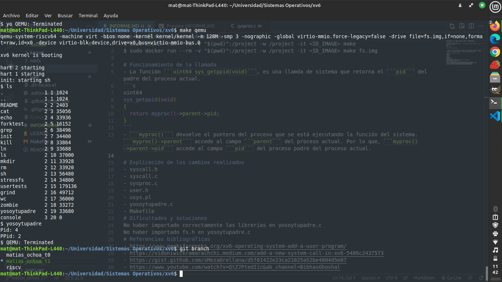

# Funcionamiento de la llamada
- La función ```uint64 sys_getppid(void)```, es una llamda de sistema que retorna el ```pid``` del padre del proceso actual.
```c
uint64
sys_getppid(void)
{
  return myproc()->parent->pid;
}
```
- ```myproc()``` devuelve el puntero del proceso que se está ejecutando la función del sistema. ```myproc()->parent``` accede al campo ```parent``` del proceso actual. Por lo que, ```myproc()->parent->pid``` accede al campo ```pid``` del proceso padre del proceso actual.


# Explicación de los cambios realizados
- Para crear la función ```getppid()``` como llamada del sistema, se tuvo que editar los siguientes archivos:
  - [syscall.h](#archivo-syscallh)
  - [syscall.c](#archivo-syscallc)
  - [sysproc.c](#archivo-sysprocc)
  - [user.h](#archivo-userh)
  - [usys.pl](#archivo-usyspl)
  - [yosoytupadre.c](#archivo-yosoytupadrec)
  - [Makefile](#archivo-makefile)


## Archivo syscall.h
- En el archivo ```syscall.h``` se tuvo que agregar la siguiente línea de código.
```h
#define SYS_getppid 22
```
- Esto se hace para agregar una nueva llamda al sistema.


## Archivo syscall.c
- En el archivo ```syscall.c``` se tuvo que agregar las siguientes líneas de código en sus respectivos lugares.
```c
// Prototypes for the functions that handle system calls.
...
extern uint64 sys_getppid(void);
...
static uint64 (*syscalls[])(void) = {
    ...
    [SYS_getppid] sysgetppid(void);
}
``` 
- Esto se hace para editar la matriz de punteros de funciones que utiliza los números definidos anteriormente (índices) como punteros a las llamadas al sistema que se definen en una ubicación diferente.


## Archivo sysproc.c
- En el archivo```sysproc.c``` se agrego la siguiente línea de código.
```c
...
uint64
sys_getppid(void)
{
  return myproc()->parent->pid;
}
```
- El códgio anterior, implementa y define la función llamada de sistema.

## Archivo user.h
- En el archivo ```user.h``` se tuvo que agregar la siguiente línea de código.
```c
//system calls
...
int getppid(void);
```
- Esta sería la función a la que llama el programa de usuario. Esta función se asignará a la llamada del sistema con el número 22 que se define como directiva del preprocesador ```SYS_getppid```.


## Archivo usys.pl
- En el archivo ```usys.pl``` se agrego la siguiente línea de código.
```pl
entry("getppid");
```
- La línea anterior ayuda a que ```getppid``` se construya en la interfaz

## Archivo yosoytupadre.c
- En el archivo ```yosoytupadre.c``` se creo el siguiente código para probar la nueva llamada del sistema.
```c
#include "kernel/types.h"
#include "kernel/stat.h"
#include "user/user.h"
#include "kernel/fs.h"

int
main(int argc, char *argv[])
{
    int pid = getpid();
    int ppid = getppid();
    printf("Pid: %d\n", pid);
    printf("PPid: %d\n", ppid);
    exit(1);
}
```


## Archivo Makefile
- En el archivo ```Makefile``` se tuvo que agregar la siguiente línea de código.
```Makefile
UPROGS =\
    ...
    $U/yosoytupadre\
```
- El código anterior, sirve para que a la hora de compilar el kernel, el archivo ```yosoytupadre.c``` también se incluya en la compilación.


# Dificultades y soluciones
- El único problema que se pudo obtener fue de no importar correctamente las librerias en ```yosoytupadre.c``` teniendo los siguiente:
```c
#include "types.h"
#include "stat.h"
#include "user.h"
#include "fs.h"
```
- En vez de esto:
```c
#include "kernel/types.h"
#include "kernel/stat.h"
#include "user/user.h"
#include "kernel/fs.h"
```


# Referencias bibliográficas
- [Xv6 operating system add a user program](https://www.geeksforgeeks.org/xv6-operating-system-add-a-user-program/)
- [Add a new system call in xv6](https://viduniwickramarachchi.medium.com/add-a-new-system-call-in-xv6-5486c2437573)
- [Extending the xv6 kernel - Adding a system call](https://gist.github.com/sMezaOrellana/d5f01422e23ca21025a52be4804d5e07)
- [Adding System Calls in xv6: Operating System Lectures 2021 | Dr.Bibhas Ghoshal IIITA](https://www.youtube.com/watch?v=QtZ7PtedIic&ab_channel=BibhasGhoshal)